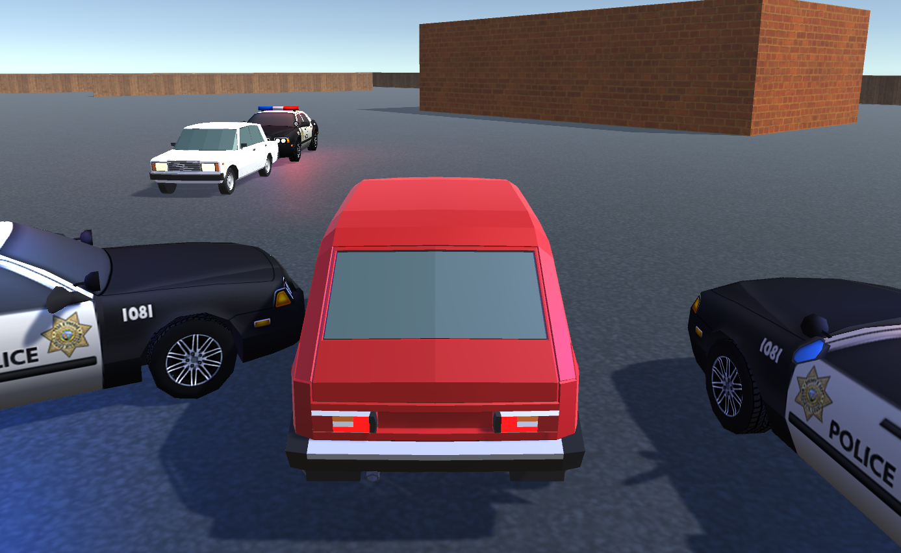

# Chase Game

**Chase** is a 3D multiplayer police chase game developed on Unity during the educational course "Environments Modeling and Development of VR and AR Applications" at RTU MIREA.

The project demonstrates the full cycle of game development: from basic scripting and navigation to multiplayer networking and VR interaction.

---

## Tech Stack

- Unity 2022.3 LTS
- C#
- Netcode for GameObjects 2.3.2
- Unity Transport 2.0.0
- XR Interaction Toolkit 2.5.0
- NavMesh (AI Pathfinding)
- UGUI (Unity Graphical User Interface)

---

## Game Features

- **Single Player Mode** – Control a car with WASD + Q/E controls, avoid police pursuit.
- **Multiplayer (P2P)** – Host/Client connection via Netcode for GameObjects with full synchronization.
- **Police AI** – NPC police cars chase the nearest player using NavMesh pathfinding.
- **Collision Effects** – Particle system on impact, damage system with cooldown.
- **Animations** – Keyframe animation for police lights (red/blue blinking).
- **Dynamic Audio** – Siren volume changes based on distance to the player.
- **UI System** – Main menu, HUD with health bar and timer, best time saving.

---

*Example of game interface*

---

## Controls

### Host / Single Player

| Action | Key |
|--------|-----|
| Accelerate / Reverse | W / S |
| Turn Left / Right | Q / E |
| Speed Boost | Left Shift |
| Camera Zoom | Mouse ScrollWheel |

### Client (Second Player)

| Action | Key |
|--------|-----|
| Accelerate / Reverse | W / S |
| Turn Left / Right | Q / E |
| Speed Boost | Left Shift |
| Camera Zoom | Mouse ScrollWheel |

Both players use identical controls. Network synchronization works correctly for all game objects.

---

## Key Implementation Details

### Multiplayer (PTP)

- Netcode for GameObjects together with Unity Transport handles all networking.
- NetworkManager is placed in PreliminaryScene with an empty Player Prefab.
- ClientNetworkTransform component enables client authority for the second player.
- Custom PTS (Packet Transport Service) messages synchronize health and position data between players.
- All game objects (player cars, police cars) are fully synchronized across the network.

### Police AI

- NavMeshSurface is baked on all scene geometry (plane, buildings).
- NavMeshAgent controls police movement toward the nearest player.
- SpawnCarRule generates police cars near players with configurable spawn interval and maximum count.

### Visual and Audio

- Particle system activates on player-police collision.
- Keyframe animation for blinking police lights is controlled via Animator.
- Siren volume dynamically adjusts based on distance to the nearest player.

---

## How to Run

1. Open the project in Unity 2022.3 LTS or higher.
2. Open the PreliminaryScene.
3. **Host:** Click "Start Game" in the menu.
4. **Client:** Build the project (File -> Build Settings -> Build), run the executable, and click "Connect".

---

## License

This project is licensed under the MIT License.

Educational project. All assets are used for non-commercial purposes.
